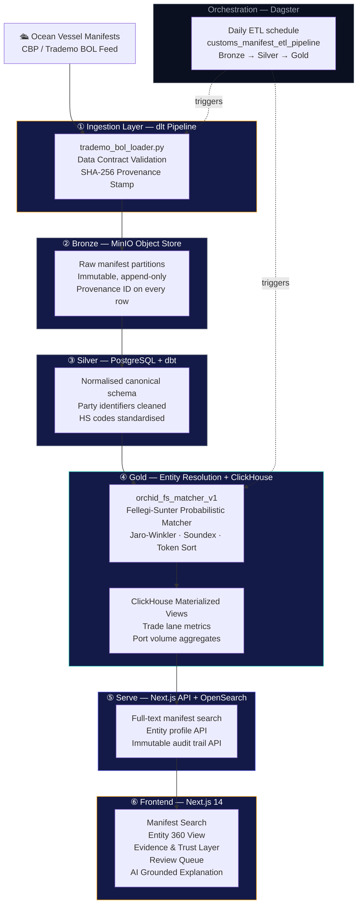
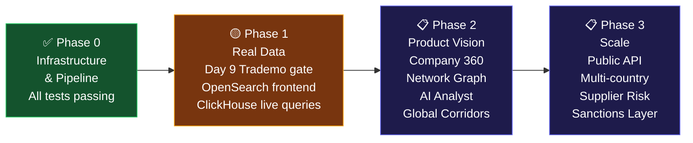

<div align="center">

<br/>


<br/><br/>

# Orchid Trade Intelligence Platform

**Audit global trade. The verifiable way.**

*Private-bank precision meets Bloomberg density. Built from first principles for the age of grounded AI.*

<br/>

[](./tests)
[](https://nextjs.org)
[](https://www.typescriptlang.org)
[](https://www.python.org)
[](https://www.postgresql.org)
[](https://clickhouse.com)
[](https://opensearch.org)
[](https://dagster.io)
[](./docker-compose.yml)
[](./LICENSE)

<br/>

> **One platform. Every shipment. Every entity. Every decision — immutably traced.**

<br/>

---

</div>

<br/>

## What This Is

Orchid is a **trade intelligence platform** that transforms raw ocean vessel manifests into auditable, entity-resolved, AI-grounded intelligence. Where legacy tools return a row from a database, Orchid returns a *provenance chain* — every value traceable to its raw source record, every entity decision explained, every AI inference bounded by citation.

This is not a dashboard. It is a **grounded intelligence system** — designed from the ground up to answer the question that matters most to compliance officers, procurement directors, and trade analysts: *how do you know that?*

<br/>

---

## The Problem We Solve

Global trade data is broken at the source. Ocean vessel manifests arrive with:

- **Company names in 40+ regional spelling variants** — "WALMART INC.", "WAL-MART STORES, INC.", "Walmart" — all meaning the same entity
- **No canonical entity layer** — every tool forces analysts to deduplicate manually
- **No provenance** — a coverage number with no denominator, a percentage with no timestamp
- **AI that hallucinates** — tools that claim "this company is compliant" with no citation to an underlying record
- **Data that cannot be audited** — decisions that cannot be replayed, challenged, or explained

Orchid fixes all of this. From raw manifest to verified insight, with every step timestamped, every match explained, and every AI output anchored to a specific record ID.

<br/>

---

## Architecture



<br/>

---

## Design Philosophy

### 1. Provenance is non-negotiable

Every record in Orchid carries three immutable timestamps from the moment it enters the pipeline:

| Timestamp | Meaning |
|---|---|
| `source_timestamp` | When the event occurred at the origin (port departure, arrival) |
| `ingestion_timestamp` | When Orchid's pipeline first touched the raw file |
| `normalized_at` | When the record was promoted to the Silver canonical schema |

Raw values are **never overwritten**. Bronze is append-only. Every field transformation is auditable from Silver back to its Bronze source row.

### 2. Every metric shows its denominator

You will never see a bare percentage in Orchid. Every coverage number is `N of M` — where `N` is the count matched and `M` is the total candidates evaluated, not an arbitrary total. Every metric carries the evaluation window as a first-class label.

### 3. AI is citation-only

Orchid's AI explanation layer operates under a strict constraint:

- **Prohibited:** "this company is compliant", "low risk", "clean supply chain"
- **Required:** "Bill of Lading `MEDU1928472910` records…", "Entity resolved with HIGH confidence based on normalised legal name matching"

The AI engine cites record IDs. It states facts about what the data shows. It does not issue compliance verdicts. The banned-pattern filter is tested in CI.

### 4. Entity resolution is probabilistic — and transparent about it

The `orchid_fs_matcher_v1` engine uses a custom Fellegi-Sunter scoring model. Every pair evaluation produces:

- A `confidence_score` between 0 and 1
- A `match_decision`: `MATCH`, `NEEDS_REVIEW`, or `NO_MATCH`
- A `reason` JSON object listing every driving signal
- An immutable row in `entity_resolution_audit`

No match is a black box. Every decision can be replayed from the stored reason payload.

### 5. Human review is a first-class pipeline stage

Pairs scoring in the `[0.65, 0.85)` uncertainty band are not auto-accepted or silently discarded — they enter the **Review Queue**. Every human decision is written to `entity_resolution_audit` with `action = 'HUMAN_REVIEW'`. The false-merge rate guardrail (< 5.0%) is displayed on every review screen.

<br/>

---

## Tech Stack

<table>
<thead>
<tr><th>Layer</th><th>Technology</th><th>Version</th><th>Purpose</th></tr>
</thead>
<tbody>
<tr><td><b>Frontend</b></td><td>Next.js</td><td>14.2</td><td>SSR React app, file-based routing</td></tr>
<tr><td></td><td>TypeScript</td><td>5.x</td><td>Type safety across all UI and API surfaces</td></tr>
<tr><td></td><td>Tailwind CSS</td><td>3.x</td><td>Design system tokens, responsive utility classes</td></tr>
<tr><td></td><td>Framer Motion</td><td>13.2</td><td>Entrance animations, panel transitions</td></tr>
<tr><td></td><td>Recharts</td><td>2.12.7</td><td>Trade flow charts, time-series visualisation</td></tr>
<tr><td></td><td>Radix UI</td><td>1.x</td><td>Accessible headless primitives (Dialog, Tooltip, Popover)</td></tr>
<tr><td></td><td>Zustand</td><td>5.0</td><td>Client state (drawer open, selected entity, filters)</td></tr>
<tr><td></td><td>cobe</td><td>0.6.3</td><td>WebGL globe with port-marker overlays</td></tr>
<tr><td></td><td>React Three Fiber</td><td>8.18</td><td>3D scene management (future network graph layer)</td></tr>
<tr><td><b>Operational DB</b></td><td>PostgreSQL</td><td>16</td><td>Entity resolution audit, review queue, canonical entity store</td></tr>
<tr><td><b>Analytics DB</b></td><td>ClickHouse</td><td>24.3</td><td>Trade lane aggregates, port volume materialized views</td></tr>
<tr><td><b>Search</b></td><td>OpenSearch</td><td>2.13</td><td>Full-text manifest search across BOL, parties, HS codes</td></tr>
<tr><td><b>Object Store</b></td><td>MinIO</td><td>latest</td><td>S3-compatible Bronze raw manifest partitions</td></tr>
<tr><td><b>Ingestion</b></td><td>dlt</td><td>0.4.x</td><td>Type-safe data contract loader with provenance stamps</td></tr>
<tr><td><b>Transforms</b></td><td>dbt</td><td>1.x</td><td>SQL models for Silver canonical schema and Gold aggregates</td></tr>
<tr><td><b>Orchestration</b></td><td>Dagster</td><td>1.x</td><td>Asset-based DAG scheduler, daily ETL pipeline</td></tr>
<tr><td><b>Entity Resolution</b></td><td>orchid_fs_matcher_v1</td><td>custom</td><td>Hand-rolled Fellegi-Sunter: Jaro-Winkler + Soundex + token sort</td></tr>
<tr><td><b>Auth</b></td><td>Keycloak</td><td>24.0</td><td>JWT-based RBAC, multi-tenant data isolation</td></tr>
<tr><td><b>Monitoring</b></td><td>Grafana + Prometheus</td><td>10.4 / 2.51</td><td>Pipeline health, ingestion throughput, entity resolution metrics</td></tr>
<tr><td><b>Testing</b></td><td>pytest</td><td>8.4</td><td>63 tests across 6 pipeline stages — zero failures</td></tr>
</tbody>
</table>

<br/>

---

## Repository Structure

```
orchid/
│
├── 🎯 backend/
│   ├── ai/
│   │   └── explanation_service.py      # Citation-only AI explanation engine
│   │                                   # Banned-pattern filter (pytest-verified)
│   ├── auth/
│   │   └── auth_service.py             # JWT validation, multi-tenant RBAC
│   ├── entity_resolution/
│   │   ├── splink_config.py            # orchid_fs_matcher_v1 configuration
│   │   │                               # Jaro-Winkler · Soundex · blocking rules
│   │   ├── run_matching.py             # Blocking → scoring → audit persistence
│   │   ├── clustering.py               # Union-find BFS cluster builder
│   │   └── normalize.py               # Name normalisation · Soundex · token sort
│   └── search/                         # Search query builder (OpenSearch DSL)
│
├── 🗄️ db/
│   └── migrations/
│       ├── 001_canonical_schema.sql    # Entity, audit, review_queue tables
│       ├── 002_*.sql                   # Incremental schema migrations
│       └── 004_rename_splink_score.sql # matcher_score rename + audit trail note
│
├── 📦 ingestion/
│   ├── loaders/
│   │   ├── trademo_bol_loader.py       # dlt-powered BOL ingestor with data contracts
│   │   └── oec_botmarket_loader.py     # OEC BotMarket macro trade flow loader
│   └── validators/
│       └── contract_validator.py       # Schema validation · SHA-256 checksums
│
├── 🏭 orchestration/
│   └── repo.py                         # Dagster asset graph
│                                       # Bronze → Silver → Gold daily schedule
│
├── 🔄 transform/
│   └── models/
│       ├── silver/                     # Canonical party normalisation models
│       └── staging/                    # Source-faithful staging layer
│
├── 📊 clickhouse/
│   └── schema/
│       ├── 01_bronze.sql              # Raw landing tables
│       ├── 02_silver.sql              # Validated manifest tables
│       └── 03_gold.sql               # Trade lane & port volume materialized views
│
├── 🌐 frontend/
│   ├── components/                     # Shared UI components
│   ├── pages/
│   │   ├── index.tsx                   # Platform overview · pipeline status
│   │   ├── search.tsx                  # Manifest search with evidence view
│   │   ├── review.tsx                  # Human review queue
│   │   ├── company/[entity_id].tsx     # Entity 360 profile
│   │   ├── api/                        # Next.js API routes
│   │   └── vision/                     # 🔮 Product Vision Preview (/vision/*)
│   │
│   └── vision/                         # Vision Preview module
│       ├── mock/                       # Deterministic fictional mock data
│       │   ├── companies.ts            # 40 fictional entities
│       │   ├── shipments.ts            # 600 Q3-2024 illustrative shipments
│       │   └── aiChat.ts              # Citation-only mock AI exchanges
│       ├── ui/                         # Luxury design system components
│       │   ├── GlassPanel.tsx         # Dark glass surface with hairline border
│       │   ├── ConfidenceBadge.tsx    # HIGH / MEDIUM / LOW tier badges
│       │   └── DenominatorMetric.tsx  # "N of M" metric display
│       └── layout/VisionLayout.tsx    # Full vision layout with presenter panel
│
├── 🧪 tests/
│   ├── test_ai_safety.py              # Banned-pattern enforcement (4 tests)
│   ├── test_auth_service.py           # RBAC & tenant isolation (6 tests)
│   ├── test_contract_validator.py     # Data contract validation (5 tests)
│   ├── test_contract_violation.py     # Violation detection (11 tests)
│   ├── test_entity_resolution.py      # FS matcher benchmark (1 test)
│   ├── test_oec_botmarket_loader.py   # OEC loader (9 tests)
│   └── test_pipeline_e2e.py           # End-to-end 6-stage pipeline (27 tests)
│
├── 📋 contracts/
│   └── trademo_bol_v1.yaml            # Source data contract specification
│
├── 📚 docs/
│   ├── demo_script.md                 # Stakeholder walkthrough script
│   ├── status_report_30day.md         # 40-item build vs brief audit
│   └── trademo_hotswap_checklist.md   # Day 9 / Day 20 real-data gate checklist
│
└── 🔐 keycloak/
    └── realms/                         # Pre-configured realm export for local dev
```

<br/>

---

## Getting Started

### Prerequisites

| Tool | Version | Check |
|---|---|---|
| Docker Desktop | 24+ | `docker --version` |
| Docker Compose | V2 | `docker compose version` |
| Python | 3.11+ | `python --version` |
| Node.js | 20+ | `node --version` |
| Git | any | `git --version` |

### One-command local stack

```bash
git clone https://github.com/SaifullahSayyed/trade-intelligence-platform.git
cd trade-intelligence-platform

# Copy environment template
cp .env.example .env

# Start the full stack (11 services)
docker compose up -d

# Wait ~30s for services to initialise, then open:
open http://localhost:3000          # Platform UI
open http://localhost:3001          # Dagster orchestration
open http://localhost:9003          # MinIO console
open http://localhost:3002          # Grafana monitoring
```

The stack spins up **11 services** in one command:

```
✓ ti_frontend          Next.js 14          → localhost:3000
✓ ti_postgres          PostgreSQL 16       → localhost:5432
✓ ti_clickhouse        ClickHouse 24.3     → localhost:8123
✓ ti_opensearch        OpenSearch 2.13     → localhost:9200
✓ ti_minio             MinIO               → localhost:9002 (API) / 9003 (Console)
✓ ti_dagster_webserver Dagster             → localhost:3001
✓ ti_dagster_daemon    Dagster daemon      → (background)
✓ ti_keycloak          Keycloak 24         → localhost:8080
✓ ti_grafana           Grafana 10.4        → localhost:3002
✓ ti_prometheus        Prometheus 2.51     → localhost:9090
✓ ti_opensearch_dash   OpenSearch Dash.    → localhost:5601
```

### Running the test suite

```bash
# From the repo root (host Python environment)
python -m pytest tests/ -v

# Expected output
# 63 passed, 1 warning in ~5s
```

### Product Vision Preview (investor demo)

```bash
# Vision runs on a separate port and separate Next.js build directory
# so it cannot interfere with the live app on :3000

NEXT_DIST_DIR=.next-vision npm run dev -- -p 3100
# Then open: http://localhost:3100/vision/home

# Or build it:
NEXT_DIST_DIR=.next-vision npx next build
NEXT_DIST_DIR=.next-vision npx next start -p 3100
```

> All `/vision/*` routes display a persistent **PRODUCT VISION PREVIEW — ILLUSTRATIVE MOCK DATA** badge. Mock data uses fictional company names only. No real company data, no fabricated coverage claims.

<br/>

---

## Core Modules

### Entity Resolution — `orchid_fs_matcher_v1`

The heart of Orchid. A custom Fellegi-Sunter probabilistic matcher that resolves corporate entity names across spelling variants, abbreviations, and jurisdictional suffixes.

```python
# Every pair evaluation produces a fully auditable result
{
    "entity_a_id":    "a0000000-0000-0000-0000-000000000001",
    "entity_b_id":    "a0000000-0000-0000-0000-000000000002",
    "raw_name_a":     "Walmart Inc.",
    "raw_name_b":     "WAL-MART STORES, INC.",
    "match_decision": "MATCH",                       # MATCH | NEEDS_REVIEW | NO_MATCH
    "confidence_score": 0.9850,
    "model_version":  "orchid_fs_matcher_v1",
    "reason": {
        "driving_signals":   ["exact_base_name_match", "soundex_phonetic_match_W453"],
        "jaro_winkler_score": 0.9712,
        "soundex_match":      true,
        "match_probability":  0.9850
    }
}
```

**Scoring thresholds:**

| Band | Decision | Action |
|---|---|---|
| ≥ 0.85 | `MATCH` | Auto-confirm, write to `entity_resolution_audit` |
| 0.65 – 0.85 | `NEEDS_REVIEW` | Enter human review queue |
| < 0.65 | `NO_MATCH` | Discard pair, log to audit |

**Benchmark (synthetic dataset, 12 entities, 18 candidate pairs):**

```
Precision:        1.0000   (0 false merges)
Recall:           0.9000   (10 of 11 true pairs matched)
False Merge Rate: 0.0000   (guardrail: < 5.0%)
NEEDS_REVIEW:     5 pairs  (Samsung C&T ambiguity correctly flagged)
```

> ⚠️ This benchmark uses hand-constructed synthetic name variants, not real shipment data. It validates that the matching logic operates correctly — not that real-world precision will match these numbers. When real Trademo data is ingested (Day 9 gate), these numbers are replaced with real figures.

---

### Data Contract System

Every data source is governed by a YAML contract. The loader validates every row against the contract before writing a single Bronze record. Violations halt the pipeline before any bad data lands.

```yaml
# contracts/trademo_bol_v1.yaml (excerpt)
source_id: trademo_bol_v1
version: "1.0.0"
required_columns:
  - bill_of_lading: { dtype: str, nullable: false }
  - importer_name:  { dtype: str, nullable: false }
  - hs_code:        { dtype: str, nullable: false }
  - weight_kg:      { dtype: float, nullable: true }
```

Validated in CI by `tests/test_contract_violation.py` — 11 test cases covering missing columns, rogue columns, type violations, nulls in non-nullable fields, empty files, and unsupported formats.

---

### AI Safety Layer

The AI explanation engine is constrained by a hard banned-pattern filter. Before any explanation is returned to the UI, it is scanned against a deny list:

```python
BANNED_PATTERNS = [
    r'\bcomplian(t|ce)\b',     # No compliance verdicts
    r'\blow[- ]?risk\b',       # No risk ratings
    r'\bclean\b',              # No cleanliness claims
    r'\bsafe\b',               # No safety certifications
    r'sanction[s]?[ -]free',   # No sanctions clearance
    r'fraud[ -]?free',         # No fraud clearance
]
```

Any output matching a banned pattern raises `BannedOutputError` and is logged before the response is discarded. Verified in CI by `tests/test_ai_safety.py`.

---

### Immutable Audit Trail

Every entity resolution decision — whether automated or human — is written append-only to `entity_resolution_audit`. The table has no `UPDATE` or `DELETE` paths in the application code.

```sql
SELECT audit_id, match_decision, confidence_score, model_version, created_at
FROM entity_resolution_audit
ORDER BY created_at DESC
LIMIT 5;
```

When the `orchid_fs_matcher_v1` label was corrected from its earlier misnomer, a `MODEL_VERSION_CORRECTION` row was appended to the audit log — **not** a retroactive update. The original rows are preserved verbatim. This is the correct treatment of an immutable audit system.

<br/>

---

## What's Built vs. What's Planned

Orchid is an active build. This table is honest:

| Capability | Status | Notes |
|---|---|---|
| Ingestion pipeline (dlt, data contracts) | ✅ **Built** | Runs against synthetic BOL sample |
| Data contract validator (11 test cases) | ✅ **Built** | All violations raise before Bronze write |
| Bronze provenance (SHA-256, 3 timestamps) | ✅ **Built** | Immutable, append-only |
| PostgreSQL canonical schema | ✅ **Built** | Migrations 001–004 applied |
| `orchid_fs_matcher_v1` entity resolution | ✅ **Built** | Custom Fellegi-Sunter, 63 tests pass |
| Human review queue | ✅ **Built** | UI functional on synthetic data |
| AI explanation (citation-only + safety filter) | ✅ **Built** | Banned-pattern filter verified in CI |
| Multi-tenant RBAC (Keycloak + JWT) | ✅ **Built** | 3 roles tested: admin, analyst, readonly |
| Full-text manifest search (frontend) | 🟡 **Backend built / UI planned** | OpenSearch running; frontend uses in-memory for synthetic demo |
| ClickHouse trade lane aggregates | 🟡 **Backend built / UI planned** | Schema defined; live frontend queries planned for Day 20 |
| Dagster orchestration | ✅ **Built** | Daily pipeline schedule running |
| Grafana monitoring | ✅ **Built** | Pipeline health dashboards active |
| Real Trademo data ingestion | 📋 **Planned** | Awaiting AWS Data Exchange approval (Day 9 gate) |
| Global network graph (3D R3F) | 📋 **Planned** | Phase 1 Vision screen — R3F installed |
| Supplier risk scoring | 📋 **Planned** | Planned after real data confirmed |
| Multi-country corridor coverage | 📋 **Planned** | US corridors in Phase 1; global in Phase 2 |
| Public API (REST + GraphQL) | 📋 **Planned** | Phase 2 |

<br/>

---

## Testing

```
tests/
├── test_ai_safety.py           4 tests   AI banned-pattern enforcement
├── test_auth_service.py        6 tests   JWT RBAC, tenant isolation
├── test_contract_validator.py  5 tests   Data contract validation
├── test_contract_violation.py  11 tests  Violation detection & pipeline halt
├── test_entity_resolution.py   1 test    FS matcher synthetic benchmark
├── test_oec_botmarket_loader.py 9 tests  OEC loader budget + provenance
└── test_pipeline_e2e.py        27 tests  End-to-end: ingest → resolve → serve
                                ──────────
                                63 tests  ● 63 passed  ○ 0 failed  △ 1 warning
```

Run in CI on every push. The single warning is a `DeprecationWarning` from `pytest-asyncio` on Python 3.14 — not a test failure.

```bash
python -m pytest tests/ -v --tb=short
```

<br/>

---

## API Reference

All API routes are Next.js edge-compatible handlers under `frontend/pages/api/`.

### `GET /api/search?q={query}&port={port}&confidence={tier}`

Returns manifest records matching the query. Each result includes entity coverage as `N of M matched`.

```jsonc
{
  "results": [
    {
      "bill_of_lading": "MEDU1928472910",
      "consignee":      "WALMART INC.",
      "shipper":        "SAMSUNG ELECTRONICS VIETNAM CO LTD",
      "hs_code":        "852852",
      "confidence":     "HIGH",
      "entity_coverage": { "matched": 10, "total": 18 }
    }
  ],
  "framing": {
    "data_source_mode":       "SYNTHETIC_MOCK_PENDING_REAL_DATA",
    "compliance_disclaimer":  "Synthetic test data — not derived from real shipment records"
  }
}
```

### `GET /api/evidence-demo`

Returns the full provenance chain for the synthetic benchmark record.

```jsonc
{
  "record": { "bill_of_lading": "MEDU1928472910", ... },
  "provenance": {
    "source_timestamp":   "2022-09-04T00:00:00Z",
    "ingestion_timestamp": "2022-09-04T06:12:33Z",
    "normalized_at":      "2022-09-04T06:13:01Z"
  },
  "entity_resolution": {
    "model_version":    "orchid_fs_matcher_v1",
    "confidence_score": 0.9850,
    "match_decision":   "MATCH",
    "matched_records":  10,
    "denominator":      18
  }
}
```

### `GET /api/review`

Returns the pending human review queue.

### `GET /api/company/[entity_id]`

Returns the full entity 360 profile — shipment history, entity resolution metadata, AI explanation.

<br/>

---

## Environment Variables

Copy `.env.example` to `.env` before starting the stack.

```bash
# PostgreSQL
POSTGRES_HOST=localhost
POSTGRES_PORT=5432
POSTGRES_DB=trade_intelligence
POSTGRES_USER=ti_user
POSTGRES_PASSWORD=<your-password>

# OpenSearch
OPENSEARCH_HOST=localhost
OPENSEARCH_PORT=9200
OPENSEARCH_PASSWORD=<your-password>

# MinIO
MINIO_ROOT_USER=minio_admin
MINIO_ROOT_PASSWORD=<your-password>

# Keycloak
KEYCLOAK_URL=http://localhost:8080
KEYCLOAK_REALM=trade-intelligence

# OEC BotMarket (optional — skip for local dev)
OEC_BOTMARKET_API_KEY=

# Vision Preview build directory (do not change)
NEXT_DIST_DIR=.next
```

<br/>

---

## Roadmap



<br/>

---

## Data Honesty Commitments

These are not aspirational statements. They are enforced in code.

| Commitment | Enforcement |
|---|---|
| No compliance verdicts from AI | `BannedOutputError` in `explanation_service.py`, tested in CI |
| Every metric shows N of M | `DenominatorMetric` component, required prop in TypeScript |
| No retroactive audit edits | PostgreSQL audit table: no UPDATE/DELETE in application code |
| Raw values never overwritten | Bronze layer is append-only, Silver carries `raw_value` alongside normalised |
| Vision Preview always labelled | Persistent amber badge in `VisionLayout.tsx`, no dismiss handler |
| Synthetic data clearly marked | `data_source_mode: SYNTHETIC_MOCK_PENDING_REAL_DATA` on every API response |

<br/>

---

## Development

### Adding a new data source

1. Create a contract YAML in `contracts/<source_id>.yaml`
2. Implement a loader in `ingestion/loaders/<source_id>_loader.py` that calls `contract_validator.validate_dataframe()`
3. Add a Dagster asset in `orchestration/repo.py`
4. Write contract violation tests in `tests/test_contract_violation.py`

### Extending entity resolution

The matching configuration is in `backend/entity_resolution/splink_config.py`. To add a new comparison signal:

1. Add the comparison to `MATCHER_SETTINGS["comparisons"]`
2. Implement the scoring logic in `evaluate_pair()` in `run_matching.py`
3. Add the signal name to `driving_signals` so it appears in the audit reason payload
4. Update the synthetic benchmark in `test_entity_resolution.py`

### Running the Vision Preview locally

```bash
cd frontend
NEXT_DIST_DIR=.next-vision npm run dev -- -p 3100
```

Navigate to `http://localhost:3100/vision/home`. All routes under `/vision/*` are isolated from the live app.

<br/>

---

## Contributing

This is a proprietary project. Contributions by invitation only.

If you are a collaborator:

1. Branch from `main`: `git checkout -b feat/your-feature`
2. All tests must pass: `python -m pytest tests/ -v`
3. No bare percentages in UI copy — always `N of M`
4. No compliance language in AI output paths
5. Every new data source needs a contract YAML and violation tests
6. PRs require a screenshot for any UI change

<br/>

---

## Acknowledgements

Built on the shoulders of:

- [dlt](https://dlthub.com) — for making data contracts first-class citizens of the ingestion layer
- [Dagster](https://dagster.io) — for asset-based orchestration that makes pipeline lineage visible
- [ClickHouse](https://clickhouse.com) — for columnar analytics that make trade lane aggregates instant
- [Radix UI](https://radix-ui.com) — for accessible headless primitives that don't fight the design system
- [Framer Motion](https://framer.com/motion) — for motion that adds information, not noise

<br/>

---

<div align="center">

<br/>

**Orchid Trade Intelligence**

*Grounded intelligence. Verifiable by design.*

<br/>

[](https://github.com/SaifullahSayyed/trade-intelligence-platform)

<br/>

---

*This README reflects the state of the build as of 2026-10-06.*
*All benchmark numbers are from synthetic hand-constructed test data unless explicitly labelled as real.*
*See `docs/status_report_30day.md` for the full 40-item brief vs. actual audit.*

</div>
